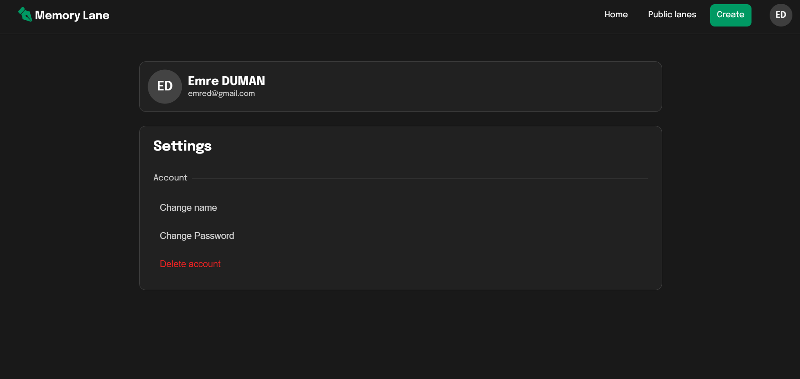

# Memory Lane

Memory Lane is a diary web application. It allows users to create accounts, log in, create diaries called "lanes", set them as public or private, and read public lanes created by other users. The app also features account management functionalities such as changing passwords, names, and deleting accounts. 

## Demo
Demo link: https://memory-lane-demo-kohl.vercel.app/ <br>
Demo version has some restrictions and some feautures of it may not work as expected.

**"Test User" credentials:** <br><br>
Email: `test@user.tld` <br>
Password: `password`


## Technologies Used

- Frontend:
  - React
  - TypeScript
  - Tiptap (for rich text editing)
  
- Backend:
  - Node.js
  - Express.js
  - MySQL
  - Sequelize (ORM for interacting with MySQL)
  
## Features

- Account creation and authentication
- Creating, viewing, and deleting diaries (lanes)
- Setting lanes as public or private
- Rich text editing capabilities for creating diaries
- Mobile-friendly design
- Account management (password change, name change, account deletion)

## Testing and Development

To run the Memory Lane web application locally in dev mode, follow these steps:

1. Clone the repository:

```bash
git clone https://github.com/emredumaan/memory-lane.git
```

2. Navigate to the project directory:

```bash
cd memory-lane
```

3. Install dependencies for the client (frontend) and server (backend):

```bash
cd client
npm install
cd ../server
npm install
```

4. Update the config file:
   - Update the database configuration in `server/config.json` with your credentials.

6. Start the backend server:

```bash
cd server
npm run dev
```

7. Start the frontend server:

```bash
cd client
npm run dev
```

8. You can access the app in your browser at `http://localhost:5173`.

## Screenshots


*Home page*


*Public lanes page*


*Sign in page*


*Create lane page*


*My lanes page*


*Account settings page*

## Credits

Memory Lane is created by Emre DUMAN. Feel free to contribute by submitting issues or pull requests.
